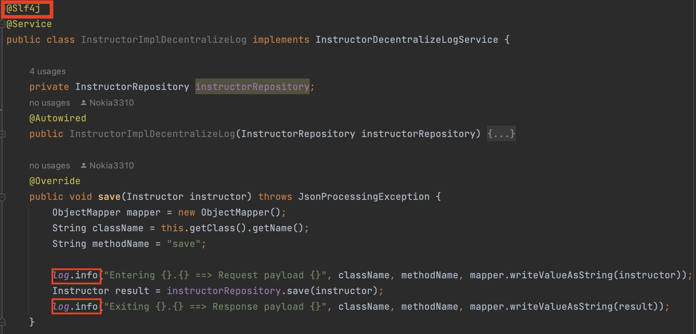
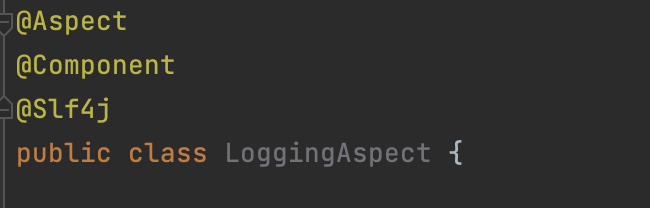
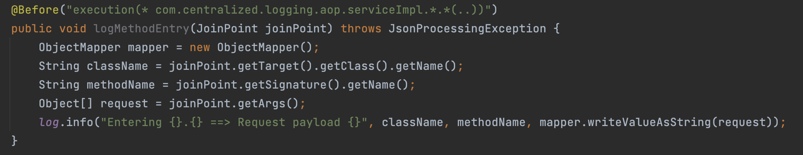

# spring-boot-centralized-logging-aop
## Introduction
When you first start coding, I believe logging is the last thing you will think about. But in fact, logging is something that we should include in development as well. Since there is an error, it can help us quickly investigate which part of our code is incorrect.

However, when I said we should write logs in our code, on the other hand, if we try to write logs in detail in all processes or write logging in many places of code, it causes our code to be messy and increases complexity. We call this problem a "cross-cutting concern ".\
Therefore, in this article, I would like to provide a way to write a log in Spring Boot in an efficient way.

## Logging in Spring Boot
Spring Boot provides built-in support for logging through the Spring Framework's abstraction layer. The default logging implementation in Spring Boot is based on the SLF4J (Simple Logging Facade for Java) API and can be customized to use various logging implementations, such as Logback, Log4j2, or Java Util Logging.

However, in this article, I will focus on logback as an example.\
Basically, to write a log in Spring Boot, you have to initialize a logger instance like below.
```java
Logger logger = LoggerFactory.getLogger(LogController.class);
```
## Logging With Lombok
Or the other way that is more convenient than above is to use `Lombok`. You need to add lombok dependency, and then just put annotation `@Slf4j` on top of the class that you would like to logger. And once you log, you can call log.info, log.debug, etc. without initializing a logger instance.



From the example code above, you're going to see that I captured the logger in two steps.\
`First one: when a method save was called. I capture the class name, method name, and request payload.`\
`Second one: after the method is saved, I capture the class name, method name, and response payload.`

And to get the class name and method name, we need to call another class and provide some hardcode as well. While this approach is straightforward and effective, But let's see if we have 10 or 20 methods, and they are also placed in different classes. This will have potential drawbacks, especially in terms of performance impact, impact on log analysis, and maintenance overhead.

## Aspect-Oriented Programming (AOP)
To address these concerns, we can consider using AOP in conjunction with Spring AOP and SLF4J.\
AOP allows for the modularization of cross-cutting concerns. `Simply put, we are going to centralize logging.`

In AOP, annotations are used to define aspects and specify where and how they should be applied in the codebase. In the context of Spring AOP, which is an AOP framework provided by the Spring Framework, several annotations are commonly used to create and configure aspects. Here are some key annotations related to AOP in Spring:

`@Aspect:` Declares a class as an aspect, allowing it to contain advice methods.

`@Before:` Specifies advice to be executed before the execution of a matched method.

`@AfterReturning:` Specifies advice to be executed after the successful execution of a matched method.

`@AfterThrowing:` Specifies advice to be executed if a matched method throws an exception.

`@After:` Specifies advice to be executed regardless of the outcome of a matched method.

`@Around:` Specifies advice to be executed around a matched method, allowing custom logic before and after method execution.

> Choosing which one depends on the specific requirements of your use case. for example
> * What information do you want to capture?
> * Which point in the method execution process do you want to capture this information?
> * Do you need to customize or modify anything before recording the information in the log file?

## Example requirement
Let's say the requirement has specifications for the following:
* Capture log at service level
* Capture log 2 step
   * 1. When entering the function, you have to print the class name, method name, and request payload.
   * 2. When the function is done, you have to print the class name, method name, and response payload.
* The log format would be like this:
   

## Implementation
According to the requirements above, we're going to analyze and implement them based on the AOP concept in the following step.
1. Configure the AOP central logging class.
2. Configure to capture a log `before` executing the function.
   * 1. Choose a suitable annotation to capture the log.
   * 2. Configure to capture at the service level (Pointcut)
   * 3. Configure log format
3. Configure to capture a log `after` executing the function.
   * 1. Choose a suitable annotation to capture the log. 
   * 2. Configure to capture at the service level (Pointcut)
   * 3. Configure log format

#### 1. Configure the AOP central logging class.


`@Aspect`  declares a class as an aspect in Spring AOP. An aspect is a module that encapsulates advice, pointcuts, and introductions.\
`@Component` Spring component, that automatically detected and registered as a Spring bean during component scanning.\
`@Slf4j` a Lombok annotation that generates a logger field for the class using SLF4J.\
`class` is named LoggingAspect, suggesting its role as an aspect responsible for logging concerns.

#### 2. Configure to capture a log `before` executing the function.
In this step, we need to find a suitable annotation candidate to capture the log `before` a function's going to execute.\
The appropriate candidate would be `@Before`. \
And the pointcut configuration can be done by using an expression to tell AOP that we will capture logs at the service level.\
The final step, we just get varialbe like lass name, method name, and request payload. Then put all of them in our log format.


#### 3. Configure to capture a log `after` executing the function.
In this step, we need to do the same thing as above, but we will capture logs `after` a function's executed.\
You might think the appropriate candidate would be `@After`, because it's quite straightforward right.\
However, there is a problem that make us unable to use @After in this case.
```java
Since the response payload from services can be null or a response with a list of objects or just objects,
in addition, there is a log format that we need to follow.
These things mean we need to check the response type and arrange them in correct format before writing a log.


```
